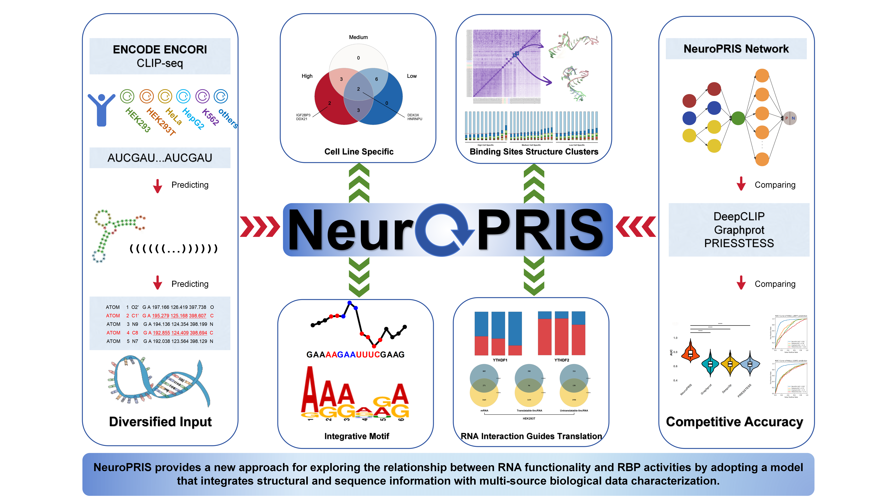

# NeuroPRIS

`NeuroPRIS` is a Python package designed for RNA sequence prediction, leveraging deep learning architectures for predictive modeling in bioinformatics.


# Overview
RNA plays an integral part in the molecular biology of cellular organisms, and understanding how RNA sequences can be accurately predicted enhances our comprehension of their role. NeuroPRIS proposes an end-to-end deep learning solution for the prediction of RNA sequence properties. Using a combination of architectural innovations including BiLSTM and 3D coordinate integration, it offers a powerful tool for understanding RNA-centric processes. The model aims to classify RNA sequences while leveraging structural information, thus providing deeper insights into RNA functions.

# Requirements

Github only provides data for testing purposes. To fully utilize the software's features, the corresponding secondary and tertiary RNA structures are required. We have uploaded the complete secondary (2DRNA.tar.gz) and tertiary structures (3DRNA.tar.gz) of 31,226 RNA sequences to https://zenodo.org/records/14848782 for users to use directly. If the RNA you wish to predict is not in our database, we recommend using the RNAfold and nsp packages we provide. You can generate the secondary structure using RNAfold and the tertiary structure using nsp, or use RNA secondary structures in dot-bracket format and RNA tertiary structures in .pdb format from any other source.

## Secondary Structure with RNAfold:
Use the RNAfold package to generate the RNA secondary structure in dot-bracket notation. We provided ViennaRNA-2.6.3.tar.
Ensure you have RNAfold installed. You can download it from the provided package link.

## Tertiary Structure with nsp:
Use the nsp package to compute the RNA tertiary structure in .pdb format. We provided nsp-lib.tar.gz.
The nsp download package is available through our platform, ensuring compatibility and standardization.

## Custom Structure Support
We also support secondary structure data in dot-bracket format and tertiary structures in .pdb format generated by other compatible software.
Secondary Structure Format: You may use secondary structure data in the commonly accepted dot-bracket notation, which is compatible with our analysis pipeline.
Tertiary Structure Format: For tertiary structures, ensure that your data is in .pdb format. This is a widely used format in structural biology and is fully supported by our tools.


## Docker Instructions(recommend)

This package comes with a pre-built Docker image to ensure ease of use and consistent performance across different environments. Download here: https://zenodo.org/records/14848782
Install Docker: For installation details, please visit the Docker official documentation and follow the instructions for your operating system.
Load the Pre-packaged Image, We provide a pre-packaged Docker image file. You can load it using the following command:

    docker load -i NeuroPRIS_images.tar
 
Run the Docker container while enabling GPU support. This command will start the container in detached mode, allowing it to run in the background:

    docker run -d --gpus all --name neuropris -p 47708:8888 -v ./NeuroPRIS(your local directory):./NeuroPRIS(container directory) -e NVIDIA_DRIVER_CAPABILITIES=compute,utility -e NVIDIA_VISIBLE_DEVICES=all xdshan/neuropris:v1.0

Interact with the running container:

    docker exec -it neuropris /bin/bash
 
## Conda Alternative
If Docker is not an option, you can set up the environment using Conda.

Create a Conda Environment: Set up a new Conda environment to run NeuroPRIS:

    conda create --name neuropris python=3.8
 
Activate the Environment:
    
    conda activate neuropris
 
Install Dependencies: Install Python packages listed in the requirements.txt:

    pip install -r requirements.txt
 
# Usage

Firstly, ensure all datasets and related PDB files are prepared in the directory. Replace placeholders with actual paths and file names.

## Traning and Predicting
```python
python main.py 
    --positive_data_path=<Path to the positive data file> \
    --negative_data_path=<Path to the negative data file> \
    --output_dataset_path=<Path where datasets will be saved> \
    --pdb_folder=<Path to the PDB folder> \
    --data_name=<Name of the dataset to be created and used>\
    --save_prefix=<Prefix for model save directories> \
    --output_path=<Path for storing prediction outputs>

example:
python ./main.py \
    --positive_data_path ./dataset/brain_ELAVL3_positive.txt \
    --negative_data_path ./dataset/brain_ELAVL3_negative.txt \
    --output_dataset_path ./dataset \
    --pdb_folder ./3DRNA \
    --data_name brain_ELAVL3_dataset \
    --save_prefix ./model \
    --output_path ./output
```
We also provide step-by-step code execution to facilitate users in replacing their own data.

## Dataset Generating
Place the standard format .pdb files into the ./3DRNA directory, and ensure that the input txt file contains sequence and dot-bracket secondary structure data.
```python
python ./DatasetGenerate.py \
    --positive_data_path=<Path to the positive data file> \
    --negative_data_path=<Path to the negative data file> \
    --output_dataset_path=<Path where datasets will be saved> \
    --pdb_folder=<Path to the PDB folder> 

example:
python ./DatasetGenerate.py \
    --positive_data_path ./dataset/brain_ELAVL3_positive.txt \
    --negative_data_path ./dataset/brain_ELAVL3_negative.txt \
    --output_dataset_path ./dataset \
    --pdb_folder ./3DRNA 
```
## Training
```python
python ./train.py \
    --output_dataset_path=<Path where datasets were saved> \
    --data_name=<Name of the dataset to be created and used> \
    --save_prefix=<Prefix for model save directories> 

example:
python ./train.py \
    --output_dataset_path ./dataset \
    --data_name brain_ELAVL3_dataset \
    --save_prefix ./model 
```
## Predicting
```python
python ./predict.py \
    --test_data_path=<Path to the test dataset> \
    --data_name=<Name of the dataset to be created and used> \
    --save_prefix=<Prefix for model save directories> \
    --output_path=<Path for storing prediction results>

example:
python ./predict.py \
    --test_data_path ./dataset/test_dataset \
    --data_name brain_ELAVL3_dataset \
    --save_prefix ./model \
    --output_path ./output
```
## Motif Generating
```python
python motif.py \
    --model_path=<Path to the model checkpoint directory> \
    --dataset_path=<Path to the generated dataset, should have dataset named "predict_dataset"> \
    --data_name=<Name of the dataset to be created and used> \
    --output_path=<Path to save the output files> \
    --seq_info_folder=<Folder containing sequence info> \
    --window_length=<Window length>

example:
python ./motif.py \
	--model_path ./model/brain_ELAVL3_dataset \
	--dataset_path ./dataset \
	--data_name brain_ELAVL3_dataset \
	--output_path ./output \
	--seq_info_folder ./dataset \
	--window_length 5
```
## Prediction Value
```python
python PredictedValue.py \
    --modelpath=<Path to the model checkpoint directory> \
    --predictdatapath=<Path to the prediction data directory> \
    --outputpath=<Path to save the output files> \
    --dataname=<Name of the dataset to be created and used>

example:
python ./PredictedValue.py \
	--modelpath ./model/brain_ELAVL3_dataset \
	--predictdatapath ./dataset/predict_dataset \
	--outputpath ./output \
	--dataname brain_ELAVL3_dataset
```
# License
This project is covered under the **MIT License**.

For further queries, feel free to get in touch!

Contact: sunliang@sdfmu.edu.cn, shanxiaodi@sdfmu.edu.cn
